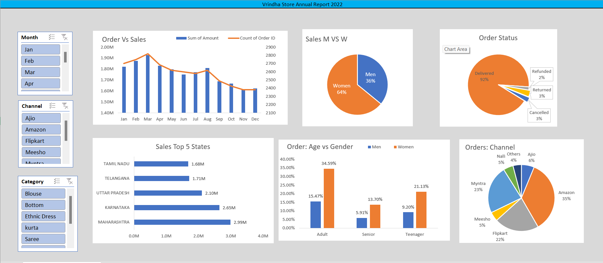

# Vrinda Store - 2022 Annual Sales Report Dashboard 📊

This project is an **Interactive Microsoft Excel Dashboard** that analyzes Vrinda Store's sales data for the year 2022. The dashboard provides valuable insights to help the store understand their customer demographics, identify top-performing months, and make data-driven decisions to boost sales in 2023.

## Key Features

- **Order vs Sales Comparison**: Visualized sales amount and order volume side by side to help track performance over the year.
- **Top Performing Month**: March was identified as the month with the highest sales and orders.
- **Customer Demographics**:
  - Women accounted for 64% of total purchases in 2022.
  - The majority of orders were placed by adults, followed by teenagers.
- **Order Status Breakdown**: 
  - 92% of orders were successfully delivered.
  - The remaining 8% were either canceled, refunded, or returned.
- **Top 5 States**: The highest contributing states were:
  1. Maharashtra
  2. Karnataka
  3. Uttar Pradesh
  4. Telangana
  5. Tamil Nadu
- **Sales Channels**: Amazon led with 35% of the total sales, followed by Myntra (23%) and Flipkart (22%).
- **Best Selling Categories**: Ethnic Dress and Saree were the most popular categories among customers.

## Technologies Used

- **Microsoft Excel**: For data visualization and dashboard creation.
- **Dataset**: Sales data from Vrinda Store for the year 2022.

## How to Use

1. Download or clone the repository.
2. Open the Excel file containing the dashboard.
3. Interact with the slicers (Month, Channel, Category) to filter and explore the data.

## Visual Overview

## Insights Gained

- **Growth Opportunities**: By analyzing sales trends and customer demographics, Vrinda Store can tailor marketing efforts to target key demographics (women and adults).
- **Channel Optimization**: The analysis highlights the importance of focusing on Amazon, Myntra, and Flipkart for boosting sales in 2023.
- **Product Focus**: Ethnic wear was a top-selling category, which could influence inventory decisions for 2023.

## Contact

Feel free to reach out if you have any questions or feedback on the project:

- **Name**: [Punu N Gowda]
- **Email**: [punungowda6@gmail.com]
